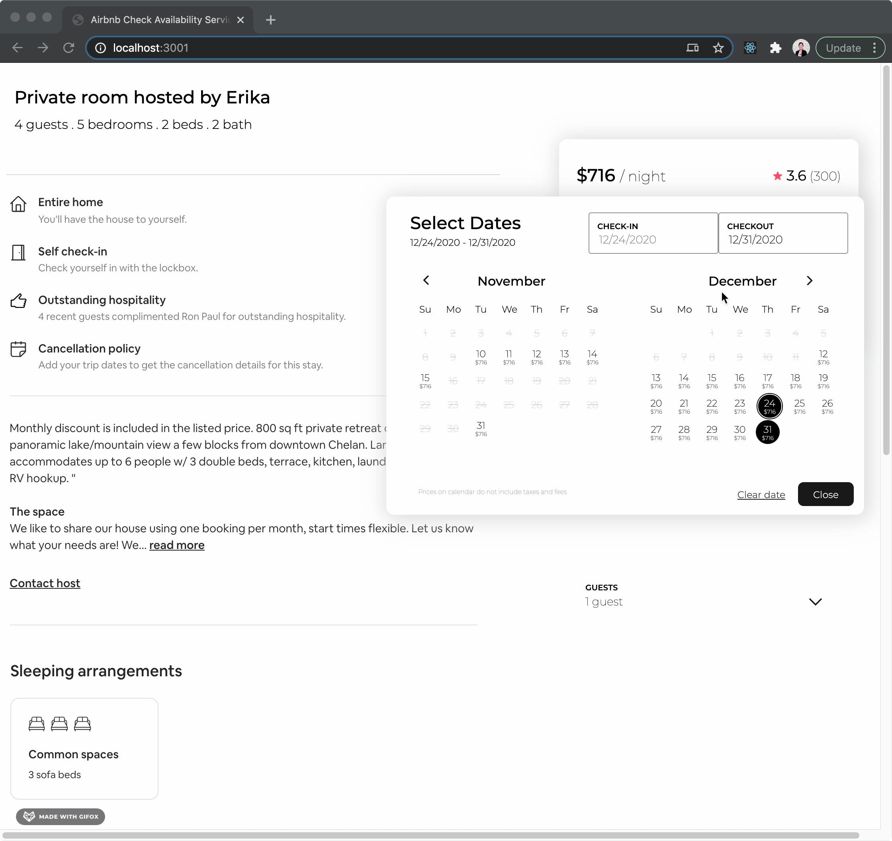
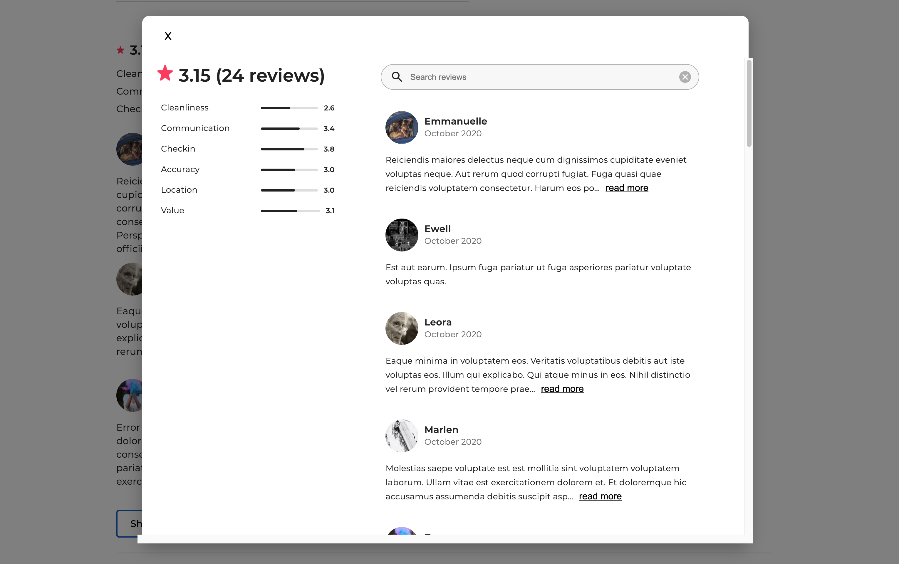
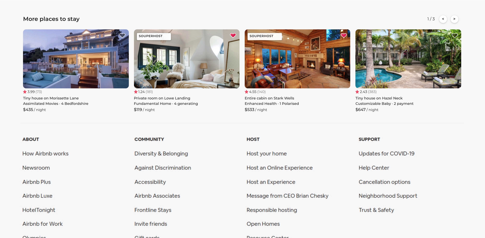
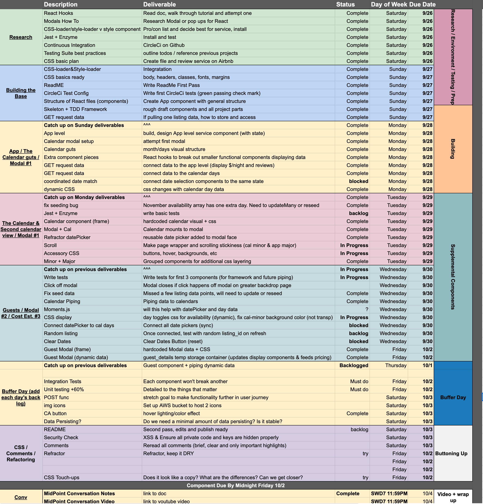
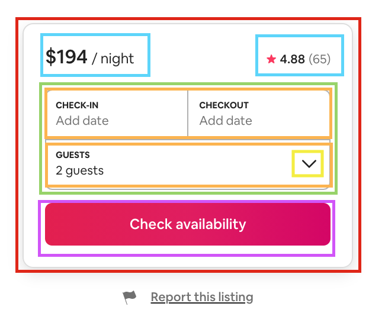
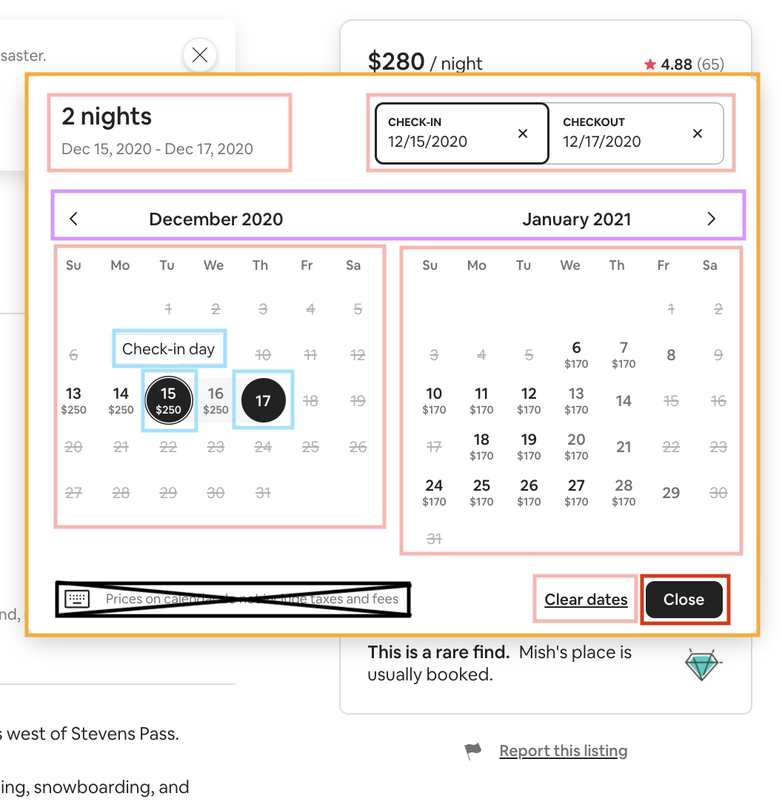
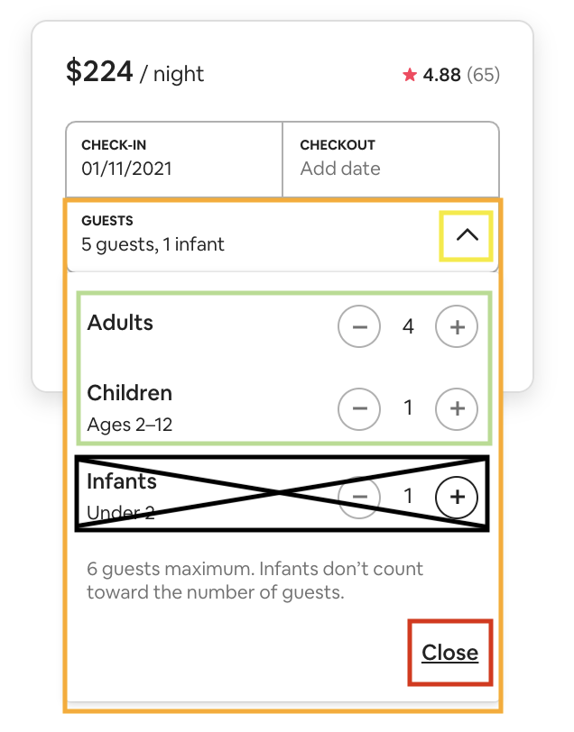
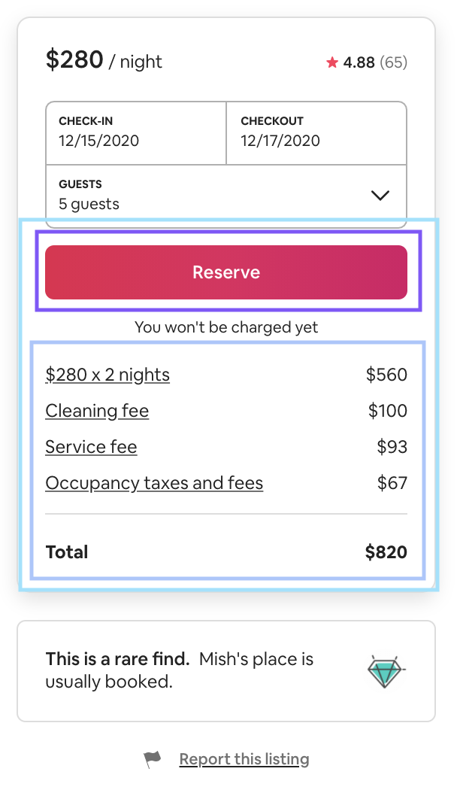
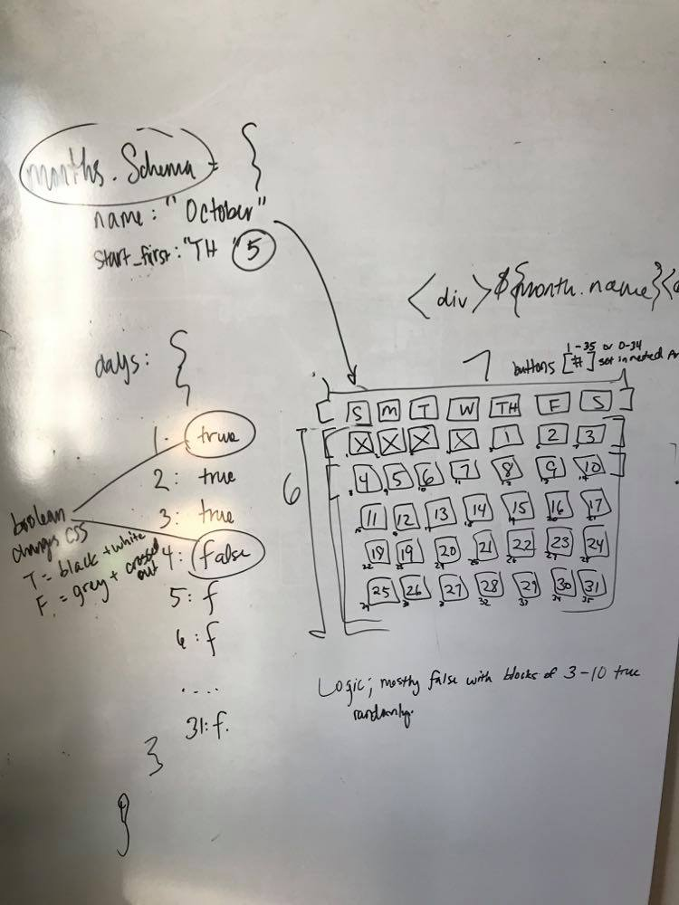

[](https://github.com/souperhost-3000/service-day-glow/)

# Built by Jacki


* I love coding, spreading positivity and hearing feedback!
* Let's connect on [](https://www.linkedin.com/in/jacki-yanamura/): [Jacki Yanamura](https://www.linkedin.com/in/jacki-yanamura/)
* Follow me on Github: [Jacki Yanamura aka Day-Glow](https://github.com/day-glow)

## Check Availability Calendar
This service focuses on the "Check Availability Calendar" of a producting listing page for an open source home rental site. It operates with it's own server and database that powers the module's UI.  It is one service of a larger service oriented architecture.



## Documentation
1. [Project ReadMe](./README.md)
1. [Getting Started](./documentation/getting-started.md)
1. [Related Projects](./documentation/related-projects.md)
1. [Design](./documentation/system-design.md)
1. [Usage](./documentation/getting-started.md)
1. [Requirements](./documentation/requirements.md)
1. [Development](./documentation/dependencies.md)
1. [Technologies](#Technologies)

## Getting Started

Clone the Github repository:
* `$ git clone https://github.com/souperhost-3000/service-day-glow.git`

Navigate inside of the directory `./service-day-glow` and run the following commands:
1. `$ npm install`
2. `$ npm run build`
3. `$ npm start`

Open a new browser tab to see the app:
* `http://localhost:3001`

## Related Projects






  - [Photo Carousel](https://github.com/souperhost-3000/service-eric)
  - [Reviews](https://github.com/souperhost-3000/service-chris)
  - [More Places to Stay](https://github.com/souperhost-3000/service-dannyhannyford)

### Front-End Challenges
1) Building an interactive [calendar](./documentation/design/mockup.md) from scratch with multiple responsive changes
2) Dependent values for price estimation
3) Reducing UI lag

### Back-End Challenges
1) Selecting database and designing schema
2) Accessing data effeciently

### Led Project Management & Team
1) [Timeline](./documentation/design/timeline.md)
2) [Mockup](./documentation/design/mockup.md)

## Timeline & Deliverables Tracker


## Planning via mock ups





## Whiteboarding UI to database


## MongoDB shape of data
Document schema sample:
```
listingSchema = {
    “listing_id”: 1,
    “price”: 100,
    “rating”: 4.5,
    “reviews_count”: 86,
     “guests_limit”: 8,
     “guests_included”: 2,
     “guest_extra_charge”: 10,
     “cleaning_fee”: 100,
     “service_fee”: 71,
     “taxes”: 51,
	“bedrooms”: 4,
	“beds”: 4,
	“bath”: 2,
	“listing_type”: Entire house,
	“host”: random name,
     “availability”: [monthSchema],
}
```

Subdocument child schema sample:
```
monthSchema = {
   name: String (i.e. October),
   days : [ 1, 1, 1, … 0 ]
}
```

## Requirements

An `nvmrc` file is included if using [nvm](https://github.com/creationix/nvm).
Find MongoDB installation documentation here [MongoDB](https://docs.mongodb.com/manual/installation/).

- Node >= 6.13.0
- MongoDB 4.4.0

### Installing Dependencies

From within the root directory:
```sh
npm install -g webpack
npm install
```

## Technologies
* React
* Node.js
* Express
* MongoDB
* Mongoose
* Wepack
* Docker
* AWS EC2 (currently not live)
